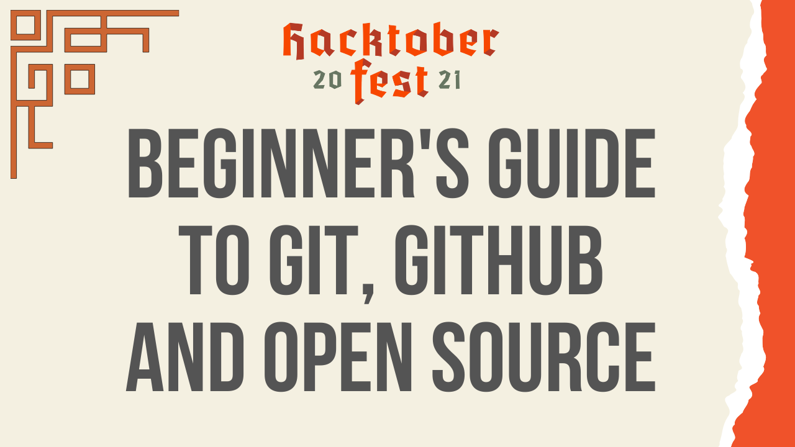

<h1 align='center'>
    👋 Beginner's guide to Git, GitHub, and Open Source 👋
</h1>1

    This repo contains the presentation for my next series on open source

    

## Video collection

------
| Session |                   Topic                   |                                 link                                  |
| :-----: | :---------------------------------------: | :-------------------------------------------------------------------: |
|    1    |                   Intro                   | [To Be Defined](https://www.youtube.com/c/TheLeanProgrammer/featured) |
|    2    |                  Why OS?                  | [To Be Defined](https://www.youtube.com/c/TheLeanProgrammer/featured) |
|    3    |        Let's have a look at GitHub        | [To Be Defined](https://www.youtube.com/c/TheLeanProgrammer/featured) |
|    4    |         What is a version control         | [To Be Defined](https://www.youtube.com/c/TheLeanProgrammer/featured) |
|    5    |         Getting started with git          | [To Be Defined](https://www.youtube.com/c/TheLeanProgrammer/featured) |
|    6    |            Basic Git commands             | [To Be Defined](https://www.youtube.com/c/TheLeanProgrammer/featured) |
|    7    |    Your first open source contribution    | [To Be Defined](https://www.youtube.com/c/TheLeanProgrammer/featured) |
|    8    | Let's do an open source contribution live | [To Be Defined](https://www.youtube.com/c/TheLeanProgrammer/featured) |
|    9    |           Where to find OS work           | [To Be Defined](https://www.youtube.com/c/TheLeanProgrammer/featured) |
|   10    |           Hacktoberfest Ethics            | [To Be Defined](https://www.youtube.com/c/TheLeanProgrammer/featured) |

